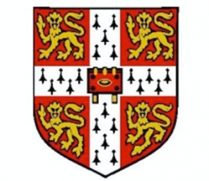

<left> <h1>About Me</h1> </left>

Hello and welcome to my website! I'm a second-year PhD student in the [ML@CL](https://mlatcl.github.io/) group at the University of Cambridge, supervised by [Dr. Ferenc Huszár](https://www.cst.cam.ac.uk/people/fh277). 

My research focuses on explaining emergent abilities of LLMs, such as in‑context learning and out‑of‑distribution generalisation, as well as related foundational questions in (algorithmic) information theory. 

Previously, I did an MPhil in Machine Learning and Machine Intelligence in Cambridge, where I worked on PAC-Bayes and optimisation. Prior to that, I was an undergraduate in Mathematics at Imperial College London.

You can find my publications [here](./publications.md) or on my [Google Scholar](https://scholar.google.com/citations?user=LknnfTQAAAAJ&hl=hu) page.

Contact: sru23 [at] cam [dot] ac [dot] uk

<left> <h1>Experience</h1> </left>

<ul style="list-style-type:none;">
<li>
	

		
		

			

			<i>October 2023 - Present, Cambridge, UK</i>  
			PhD in Machine Learning, Department of Computer Science, University of Cambridge  
			Supervisor: Professor Ferenc Huszár  
			Topics: LLMs, deep learning theory, Bayesian inference, algorithmic information theory
			

		

	

</li>
<li>
	

		
		

			

			<i>April 2024 - June 2024, London, UK</i>  
			Deep Tech Fellow, LakeStar Advisors LLP  
			Conducted a Deep Dive  and provided investment advice in 'Next-generation deep learning architectures'.
			

		

	

</li>
<li>
	

		
		

			

			<i>October 2022 - August 2023, Cambridge, UK</i>  
			MPhil in Machine Learning and Machine Intelligence, University of Cambridge  
      Distinction, graduated 2nd in class
			

		

	

</li>
<li>
	

		
		

			

			<i>October 2019 - July 2022, London, UK</i>  
			BSc Mathematics, Imperial College London  
      First Class Honours, scored in the top 5-10% in all years
			

		

	

</li>
</ul>

